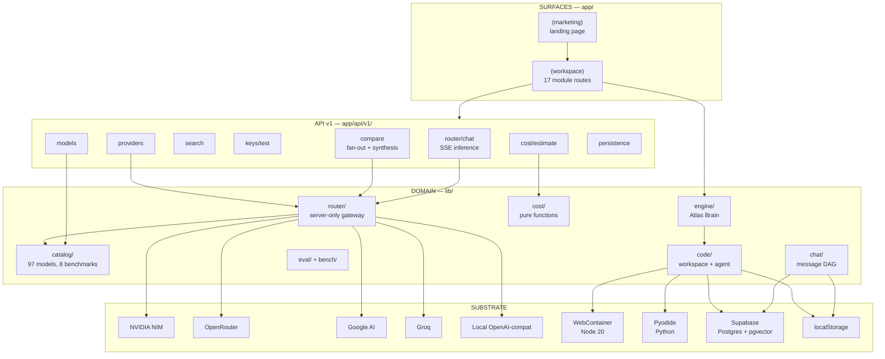
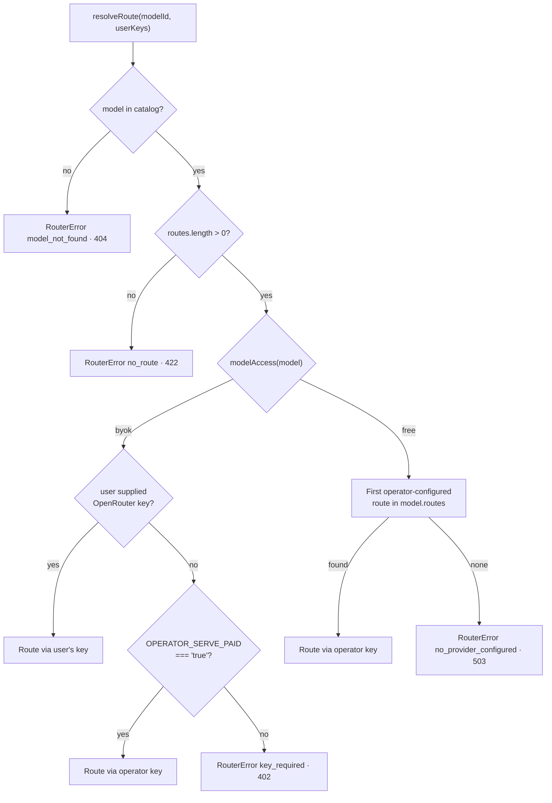
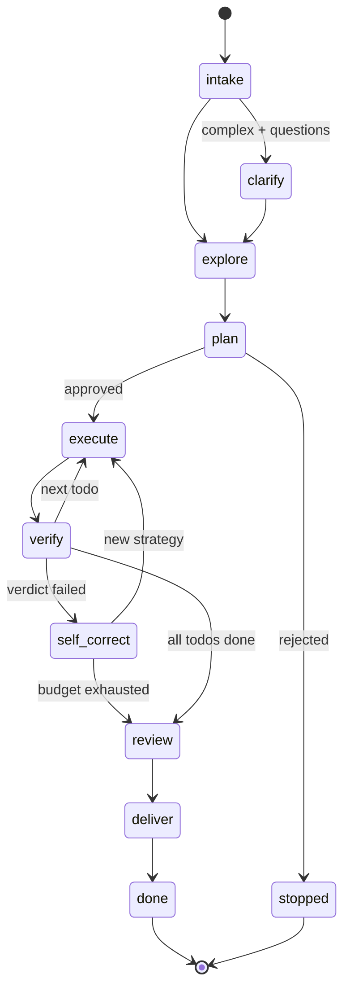

# LLM Atlas — Project Overview

> **An exhaustive technical reference for the LLM Atlas codebase.**
> Companion to `README.md`. Where the README describes *what the product claims to do*, this document describes *how the code is actually organized, what every seam is, and which parts are real vs. seeded demo data*.
>
> Derived from a full read of the repository at commit `289049d` ("Initial commit: LLM Atlas Ultimate"). Every claim below was verified against source; §18 names the file that proves each gap.

---

## Table of contents

1. [What this is](#1-what-this-is)
2. [Quick start](#2-quick-start)
3. [Architecture at a glance](#3-architecture-at-a-glance)
4. [Directory map](#4-directory-map)
5. [Routing & pages](#5-routing--pages)
6. [API reference](#6-api-reference)
7. [The Atlas Router](#7-the-atlas-router)
8. [Model catalog](#8-model-catalog)
9. [Atlas Brain — the agent engine](#9-atlas-brain--the-agent-engine)
10. [Atlas Code — browser coding workspace](#10-atlas-code--browser-coding-workspace)
11. [Atlas Chat](#11-atlas-chat)
12. [The other modules](#12-the-other-modules)
13. [State management](#13-state-management)
14. [Data & persistence](#14-data--persistence)
15. [Design system & UI conventions](#15-design-system--ui-conventions)
16. [Configuration](#16-configuration)
17. [Testing](#17-testing)
18. [Reality check — gaps, risks & demo data](#18-reality-check--gaps-risks--demo-data)
19. [Glossary](#19-glossary)

---

## 1. What this is

**LLM Atlas** is a self-hostable Next.js 15 application that puts the entire LLM lifecycle — learn, research, compare, cost, and build — behind one workspace, one model catalog, and one OpenAI-compatible inference gateway.

It is built in a design language the README calls **"Cartographic Intelligence"**: dark-first, a cyan→violet accent gradient, an interactive Canvas constellation hero, and disciplined Framer Motion with `prefers-reduced-motion` fallbacks throughout.

### Headline numbers

| Metric | Count | Source of truth |
|---|---|---|
| Product modules | 16 | `lib/modules.ts` (14 `live`, 2 `soon`) |
| Page routes | 18 | 1 marketing + 17 workspace `page.tsx` files |
| API endpoints | 8 | `app/api/v1/**/route.ts` |
| Catalog models | 97 | `lib/catalog/models.ts` |
| Model brands | 20 | derived from `provider` field |
| Route providers | 5 | `lib/catalog/providers.ts` |
| Benchmark suites | 8 | `lib/catalog/benchmarks.ts` |
| Postgres tables | 13 | `supabase/migrations/` (9 + 4) |
| Zustand stores | 11 | `lib/store/` |
| Feature flags | 11 | `lib/flags.ts` (all default-off) |
| Component files | 83 | `components/**/*.tsx` |
| Library files | 83 | `lib/**/*.ts` |
| Unit tests | 114 cases / 13 files | `lib/**/*.test.ts` |

### How the pieces fit

A user lands on a marketing page (`app/(marketing)/`), then enters a workspace shell (`app/(workspace)/`) whose sidebar, top bar, and ⌘K palette are all generated from a single module registry (`lib/modules.ts`). Every workspace page is a thin server component that mounts one `"use client"` root from `components/<module>/`. Those client roots never talk to providers directly — they stream through `app/api/v1/` route handlers, which are the only code allowed to touch the server-only **Atlas Router** (`lib/router/`). The Router resolves a catalog model id to a concrete provider + upstream model id, decides whether the operator's key or the user's BYOK key pays for it, and normalizes five different providers into one typed event stream.

Two subsystems sit beside that spine: **Atlas Brain** (`lib/engine/`), a framework-agnostic agent state machine that is unit-tested in a plain Node environment and reaches the app only through an injected `TaskPorts` interface; and **Atlas Code** (`lib/code/`), a browser-side coding workspace running real Node via WebContainer and real Python via Pyodide.

Persistence is optional everywhere. Chat, Playground, and Code sessions each expose a repo interface with two drivers — `localStorage` and Supabase — selected at runtime by whether Supabase env vars are set.

---

## 2. Quick start

```bash
npm install
```

```bash
cp .env.example .env.local
```

```bash
npm run dev
```

The app runs at `http://localhost:3000` with **zero configuration** — the catalog, leaderboard, cost engine, playground UI, and every static module work without any key. To enable live inference, set **one** of these in `.env.local` and restart:

```bash
NVIDIA_API_KEY=...                      # build.nvidia.com — serves the free open catalog
OPENROUTER_API_KEY=...                  # openrouter.ai/keys
LOCAL_BASE_URL=http://localhost:11434/v1  # Ollama / vLLM / llama.cpp
```

Closed/frontier models are **BYOK by default** — each user pastes their own OpenRouter key in the app's Vault, and it never touches the server's disk or logs.

### npm scripts

| Script | Command | Notes |
|---|---|---|
| `dev` | `next dev` | Port 3000 |
| `dev:preview` | `set NEXT_DIST_DIR=.next-preview&& next dev -p 3105` | Second dev server with its own build dir. **Windows-only `set` syntax** — see §18 |
| `build` | `next build` | Type errors fail the build; lint does not |
| `start` | `next start` | Production server |
| `lint` | `next lint` | Run separately from build |
| `typecheck` | `tsc --noEmit` | |
| `test` | `vitest run` | 114 cases, Node environment |
| `test:watch` | `vitest` | |
| `verify` | `npm run typecheck && npm run test` | The pre-commit gate |

### Claude Code launch configs

`.claude/launch.json` defines two dev servers — `atlas` (port 3000) and `atlas-alt` (port 3105). This is the only Claude Code integration in the repo: there is no `CLAUDE.md`, no `.claude/agents/`, no `.claude/skills/`, and no `settings.json`.

---

## 3. Architecture at a glance



### The three cross-cutting seams

1. **`lib/router/` is server-only.** It reads `process.env` for operator keys and is imported exclusively by `app/api/v1/*/route.ts`. Nothing in `components/` can reach a provider directly. The browser's counterpart is `lib/sse-client.ts`, a 60-line `postSSE()` async generator.

2. **`lib/engine/ports.ts` is the engine↔app boundary.** The `TaskPorts` interface (28 members) is the *only* way Atlas Brain touches the world — no React, no Zustand, no direct `runAgent` or workspace imports. `lib/store/code-store.ts` builds a real `TaskPorts` from its plumbing; tests build fakes. This is why the whole engine is testable under `environment: "node"`.

3. **The dual-driver repo pattern.** `lib/chat/repo.ts`, `lib/playground/repo.ts`, and `lib/code/sessions.ts` each export an interface, a localStorage driver, a Supabase driver, and a selector function keyed on `isSupabaseConfigured()`. Callers never know which is active.

---

## 4. Directory map

```
D:\claude\Llm Atlas Ultimate\
├── app/                          # Next.js App Router — 30 files
│   ├── layout.tsx                # Root: 3 Google fonts → CSS vars, metadata, viewport, <Providers>
│   ├── globals.css               # 345 lines — Tailwind layers + design tokens (light & dark)
│   ├── (marketing)/              # Public landing — layout + page, composes 8 landing sections
│   ├── (workspace)/              # App shell — sidebar + topbar + 17 module routes
│   └── api/v1/                   # 8 route handlers, all runtime = "nodejs"
│
├── components/                   # 83 .tsx files, ~17,600 lines — nearly all "use client"
│   ├── ui/                       # 19 hand-written shadcn-style primitives on Radix + cva
│   ├── shell/                    # sidebar, topbar, model-switcher, mobile-nav, page-transition
│   ├── landing/                  # 11 marketing sections incl. the Canvas constellation
│   ├── motion/                   # Reveal, CountUp, Magnetic — reduced-motion aware
│   ├── brand/                    # AtlasMark logo SVG, generative ModuleGlyph
│   ├── chat/ code/ compare/ …    # one dir per module, each with a <module>-client.tsx root
│   ├── providers.tsx             # next-themes + Radix TooltipProvider — the only global provider
│   ├── command-palette.tsx       # ⌘K, cmdk, two-page state machine
│   ├── shortcuts.tsx             # global keybindings + shared ARIA live region
│   └── markdown.tsx              # react-markdown + GFM + KaTeX + Mermaid + highlight.js
│
├── lib/                          # 83 .ts files — all domain logic
│   ├── catalog/                  # models.ts (91 KB, 97 models), benchmarks, providers, selectors
│   ├── router/                   # index.ts (server-only gateway) + sse.ts
│   ├── engine/                   # Atlas Brain — 12 modules + 10 test files, framework-agnostic
│   ├── code/                     # workspace (WebContainer/memory), tools, agent, policy, pyodide
│   ├── chat/                     # message DAG, repo, attachments, memory, health, escalate
│   ├── playground/               # config types, repo, cURL/TS/Python code generators
│   ├── cost/engine.ts            # pure cost functions — API, self-host TCO, break-even
│   ├── eval/graders.ts           # shared grading implementation
│   ├── bench/suites.ts           # 3 eval suites, 7 cases
│   ├── store/                    # 11 Zustand stores
│   ├── supabase/                 # lazy browser client, server client, row types
│   ├── hooks/                    # useMediaQuery, useProviders, useUserKeyHeaders, useSpeech
│   ├── flow/ learn/ news/        # static data modules for Flow, Learn, News
│   ├── modules.ts                # THE module registry — drives all navigation
│   ├── flags.ts                  # 11 feature-flag definitions
│   ├── sse-client.ts             # postSSE() + SSEHttpError
│   ├── diff.ts                   # LCS line diff, shared by 3 consumers
│   ├── motion.ts                 # framer-motion easing/spring/variant tokens
│   ├── atlas-events.ts           # app-wide event bus + ARIA announce()
│   └── utils.ts                  # cn(), formatters, clamp, hash01
│
├── supabase/migrations/          # 0001_init.sql (9 tables), 0002_depth_v2.sql (4 tables)
├── .claude/launch.json           # two dev-server configs
├── next.config.mjs               # distDir override, COOP/COEP headers scoped to /code
├── tailwind.config.ts            # CSS-variable token system, 9 keyframes
├── vitest.config.ts              # node env, lib/**/*.test.ts only
└── .env.example                  # 18 documented env vars
```

---

## 5. Routing & pages

### The uniform pattern

Every workspace route follows the same shape:

```tsx
// app/(workspace)/<module>/page.tsx  — server component
export const metadata: Metadata = { title: "…", description: "…" };

export default function Page() {
  return <ModuleClient />;   // the single "use client" root
}
```

The server page's entire job is to export `metadata` and mount one client root from `components/<module>/<module>-client.tsx`. Routes that accept URL state use the Next 15 **async `searchParams: Promise<…>`** signature and `await` it before passing typed props down.

### All 18 routes

| Route | File | Type | `searchParams` | Client root | Title |
|---|---|---|---|---|---|
| `/` | `app/(marketing)/page.tsx` | Server | — | 8 landing sections | *(root default)* |
| `/chat` | `app/(workspace)/chat/page.tsx` | Server → client | `?model=` → `initialModelId` | `ChatClient` | Chat |
| `/code` | `app/(workspace)/code/page.tsx` | Server → client | — | `CodeClient` | Atlas Code |
| `/flow` | `app/(workspace)/flow/page.tsx` | Server → client | — | `FlowClient` | Atlas Flow |
| `/playground` | `app/(workspace)/playground/page.tsx` | Server → client | `?prompt=` → `initialPrompt` | `PlaygroundClient` | Atlas Playground |
| `/compare` | `app/(workspace)/compare/page.tsx` | Server → client | `?models=a,b,c` split/trim | `CompareClient` | Compare |
| `/bench` | `app/(workspace)/bench/page.tsx` | Server → client | — | `BenchClient` | Atlas Bench |
| `/leaderboard` | `app/(workspace)/leaderboard/page.tsx` | Server → client | `?access=free\|byok` | `LeaderboardClient` | Leaderboard |
| `/cost` | `app/(workspace)/cost/page.tsx` | Server → client | `?model=` → `initialModelId` | `CostClient` | Cost |
| `/news` | `app/(workspace)/news/page.tsx` | Server → client | `getNewsSnapshot()` | `NewsClient` | Atlas News |
| `/router` | `app/(workspace)/router/page.tsx` | Server → client | — | `RouterClient` | Atlas Router |
| `/hub` | `app/(workspace)/hub/page.tsx` | Server → client | — | `HubClient` | Atlas Hub |
| `/learn` | `app/(workspace)/learn/page.tsx` | Server → client | — | `LearnClient` | Atlas Learn |
| `/prompt` | `app/(workspace)/prompt/page.tsx` | Server → client | — | `PromptClient` | Atlas Prompt |
| `/vault` | `app/(workspace)/vault/page.tsx` | Server → client | — | `VaultClient` | Atlas Vault |
| `/datasets` | `app/(workspace)/datasets/page.tsx` | **Fully server** | — | `ModulePlaceholder` | Atlas Datasets |
| `/notebooks` | `app/(workspace)/notebooks/page.tsx` | **Fully server** | — | `ModulePlaceholder` | Atlas Notebooks |
| `/docs` | `app/(workspace)/docs/page.tsx` | **Fully server** | — | inline JSX (3 cards) | Docs & Help |

`/datasets` and `/notebooks` are the two modules marked `status: "soon"` in `lib/modules.ts`, which is exactly why they render the server-safe `ModulePlaceholder` instead of a client root. `/docs` is the one workspace page with real inline JSX and is deliberately a placeholder pointing at a future `apps/docs`.

### Layouts

| File | Role |
|---|---|
| `app/layout.tsx` | Root. Loads Inter → `--font-sans`, Space Grotesk → `--font-display`, JetBrains Mono → `--font-mono`. Sets `metadataBase`, a title template (`%s · LLM Atlas`), OpenGraph, Twitter card, and dual `themeColor` viewport queries (`#0A0B0F` / `#F8F9FC`). `suppressHydrationWarning` on both `<html>` and `<body>` because `next-themes` mutates classes pre-hydration. |
| `app/(marketing)/layout.tsx` | `<LandingNav />` + `<main>` + `<Footer />` |
| `app/(workspace)/layout.tsx` | `<Sidebar />` alongside `<Topbar />` + `<main class="flex-1 pb-24 lg:pb-0">` wrapping children in `<PageTransition>`, then four layout-level overlays that persist across navigation: `MobileTabBar`, `MobileDrawer`, `CommandPalette`, `Shortcuts`. The `pb-24 lg:pb-0` reserves space for the mobile tab bar. |

### What is *not* present

There is **no `middleware.ts`** anywhere in the repo, **no server actions** (`grep -r "use server"` returns zero hits), **no dynamic segments, catch-alls, parallel routes, or intercepting routes**, and **no `error.tsx` / `loading.tsx` / `not-found.tsx` / `global-error.tsx` / `template.tsx`** in any of the 18 pages. All loading and error UI lives inside the client roots. There is also no `sitemap.ts`, `robots.ts`, `manifest.ts`, or `opengraph-image` file convention, and no `generateMetadata()` — every page's metadata is static.

---

## 6. API reference

All 8 endpoints live under `app/api/v1/` and export `runtime = "nodejs"`.

### Authentication model

**There is no session auth, no bearer token, and no middleware on any endpoint.** The only credential is an optional per-request header:

```
x-openrouter-key: sk-or-v1-…
```

This is the user's own OpenRouter key (BYOK). It is read from the header, passed into `resolveRoute()`/`streamChatEvents()` as `UserKeys`, forwarded upstream, and — per explicit comments in every handler — never logged, persisted, or echoed. Operator keys live in `process.env` and are read only inside `lib/router/index.ts` and `lib/supabase/server.ts`.

### Endpoint summary

| Method | Path | `dynamic` | Response | In-repo consumers |
|---|---|---|---|---|
| POST | `/api/v1/router/chat` | force-dynamic | SSE | chat, playground, bench, learn, router, code agent |
| POST | `/api/v1/compare` | force-dynamic | SSE | compare |
| POST | `/api/v1/search` | force-dynamic | JSON | chat |
| POST | `/api/v1/keys/test` | force-dynamic | JSON | vault |
| GET | `/api/v1/providers` | force-dynamic | JSON | `useProviders()` hook |
| GET | `/api/v1/persistence` | force-dynamic | JSON | **none** |
| GET | `/api/v1/models` | — | JSON | **none** (public/SDK surface) |
| POST | `/api/v1/cost/estimate` | — | JSON | **none** (public/SDK surface) |

---

### `POST /api/v1/router/chat`

**`app/api/v1/router/chat/route.ts` — the core inference endpoint.** Every streaming feature in the app funnels through it.

**Request body**

```ts
{
  modelId: string;                  // required — a catalog model id
  messages: ChatMessage[];          // required
  temperature?: number;
  topP?: number;
  topK?: number;
  maxTokens?: number;
  stop?: string[];
  seed?: number;
  frequencyPenalty?: number;
  presencePenalty?: number;
  reasoningEffort?: "low" | "medium" | "high";
  responseFormat?: { type: "text" } | { type: "json_object" }
                 | { type: "json_schema"; json_schema: Record<string, unknown> };
  tools?: ToolDef[];
  toolChoice?: "auto" | "none" | "required" | { type: "function"; function: { name: string } };
}
```

**Design note — pre-flight routing.** `resolveRoute()` runs *synchronously before the stream opens*, so a routing failure returns a clean JSON error with a real HTTP status rather than a half-open SSE stream:

| Failure | HTTP | `code` |
|---|---|---|
| Malformed JSON | 400 | — |
| Missing `modelId` / non-array `messages` | 400 | — |
| Unknown model | 404 | `model_not_found` |
| Model has no routable provider | 422 | `no_route` |
| Closed model, no user key, `OPERATOR_SERVE_PAID` unset | **402** | `key_required` |
| Free model, no operator key configured | **503** | `no_provider_configured` |

**SSE event protocol** (headers: `text/event-stream`, `no-cache, no-transform`, `X-Accel-Buffering: no`)

| Event | Payload | Meaning |
|---|---|---|
| `meta` | `{ provider }` | Emitted first, optimistically, from the pre-flight resolve |
| `delta` | `{ text }` | Visible content token. **Named `delta`, not `token`,** for back-compat with existing clients |
| `reasoning` | `{ text }` | Chain-of-thought token (from `reasoning_content` or `reasoning`) |
| `tool_call` | `{ id, name, arguments }` | Flushed once fully accumulated |
| `usage` | `{ promptTokens, completionTokens, totalTokens }` | |
| `done` | `{ finishReason }` | |
| `meta` *(again)* | `{ provider }` | **Correction.** A free model can fail over to a backup provider mid-stream (first choice 429/5xx); the optimistic first `meta` is superseded |
| `error` | `{ message, code }` | Mid-stream failures emit this rather than tearing down the connection; `code` defaults to `upstream_error` |

`controller.close()` runs in a `finally` block, and `req.signal` is threaded into the router so client aborts propagate upstream.

---

### `POST /api/v1/compare`

**`app/api/v1/compare/route.ts` — multi-model fan-out plus synthesis.** The largest route handler at 142 lines.

**Request body**

```ts
{ query: string; modelIds: string[]; temperature?: number; synthesisModelId?: string }
```

Returns `400` on malformed JSON, empty `query`, or an empty `modelIds` array.

**Phase 1 — concurrent fan-out.** A `Promise.all` over `modelIds` streams every model at the same time, each emitting into the shared SSE channel tagged with its `id`. The system prompt is fixed (`"Answer the user's question clearly and concisely. Be direct."`) and temperature defaults to `0.6`. Unknown ids and per-model failures emit `model_error` carrying the `RouterError` code — so a mixed fan-out of free and BYOK-only models is legal, and closed models without a key surface `key_required` in their own column instead of failing the whole request.

**Phase 2 — synthesis.** Answers with non-empty text are collected. If at least one survives, the synthesizer is chosen as: the caller's `synthesisModelId` if it resolves in the catalog, else `pickSynthesizer()` — a helper that walks `modelIds` in order and returns the first one `resolveRoute()` accepts, falling back to `modelIds[0]`. The prompt builds a corpus of `### <model name>\n<answer>` blocks and **mandates an exact markdown skeleton**:

```
## Synthesis
<a single best merged answer, 2-5 sentences>

## Agreements
- <points most/all models agree on>

## Divergences
- <points where models disagree or differ in emphasis>
```

It runs at `temperature: 0.3` under a *"careful synthesis agent… Never invent facts"* system prompt. The client (`components/compare/compare-client.tsx`) parses those exact headings back out with a regex section splitter, falling back to raw text if the model didn't comply.

**Nine event types:** `model_start` · `model_meta` · `model_delta` · `model_done` · `model_error` · `synthesis_start` · `synthesis_delta` · `synthesis_done` · `synthesis_error`. Always terminates with `{ type: "done" }`.

---

### `POST /api/v1/search`

**`app/api/v1/search/route.ts` — keyless web search** backing chat citations.

Body: `{ query: string; count?: number }` — `count` clamped to `[1, 8]`, default 5. Scrapes `https://html.duckduckgo.com/html/` with a form-encoded `q`, a spoofed desktop Chrome `User-Agent`, and `AbortSignal.timeout(9000)`. Parsing is **regex-based over the returned HTML**: `a.result__a` for href + title, `a.result__snippet` for snippets, zipped positionally. A `realUrl()` helper unwraps DuckDuckGo's `/l/?uddg=<encoded>` redirect wrapper; a `decode()` helper strips tags, un-escapes 7 HTML entities, and collapses whitespace. Ad links matching `duckduckgo.com/y.js` are filtered out.

Response: `{ sources: Array<{ title, url, snippet }> }`.

**Failure policy is total and deliberate.** A non-200, a timeout, a network error, or a DuckDuckGo markup change all degrade to `{ sources: [] }`. Only malformed request JSON returns a 400. The design note in the file is explicit: *never fail the chat over search*.

---

### `POST /api/v1/keys/test`

**`app/api/v1/keys/test/route.ts` — BYOK key validation** for the Vault.

Reads and trims `x-openrouter-key`; missing → `400 { ok: false, error: "No key provided" }`. Calls `GET {OPENROUTER_BASE_URL || default}/key` with `Authorization: Bearer <key>`, `cache: "no-store"`, and `AbortSignal.timeout(12_000)`.

**Status mapping is intentional:**

| Upstream | This endpoint returns |
|---|---|
| Unreachable / transport failure | HTTP **502** |
| `401` / `403` | HTTP **200** with `{ ok: false, error: "Key was rejected by OpenRouter" }` |
| Other non-OK | HTTP **200** with `{ ok: false, error: "OpenRouter responded <status>" }` |
| OK | HTTP 200 with the sanitized projection below |

Only a transport failure is a real error status — a rejected key is a normal, renderable outcome. Success returns a **sanitized projection, never the raw key**: `{ ok: true, label, usage, limit, limitRemaining, isFreeTier, rateLimit }`, mapped from OpenRouter's snake_case fields with defensive defaults (`label ?? "OpenRouter key"`, `usage` coerced to `0` unless numeric).

---

### `GET /api/v1/providers`

Reports operator configuration **without ever exposing keys**. Calls `configuredProviderIds()`.

```ts
{
  any: boolean,          // ≥1 provider configured
  freeReady: boolean,    // nvidia OR openrouter OR local configured
  servePaid: boolean,    // OPERATOR_SERVE_PAID === "true" AND openrouter configured
  configured: ProviderId[],
  providers: Array<{ id, name, configured }>   // all 5, flagged
}
```

Consumed by `lib/hooks/use-providers.ts`, which feeds `components/provider-banner.tsx` (the amber "connect a provider" callout shown by Chat, Compare, Playground, Bench, and Learn when `!loading && !any`).

---

### `GET /api/v1/models`

Catalog read API, driven purely by query params applied as successive filters:

| Param | Effect |
|---|---|
| `license` | Exact match on `open` / `proprietary` |
| `access` | `free` / `byok`, via `modelAccess(m)` |
| `minContext` | Numeric `contextWindow >= n` |
| `caps` | Comma-separated. Recognizes `vision`, `reasoning`, `tools`. Unrecognized values are ignored |

Returns `{ count, models }`. Self-described in a comment as backing docs/SDK examples; no in-repo client calls it.

---

### `POST /api/v1/cost/estimate`

Body is entirely optional — malformed JSON silently falls back to defaults:

```ts
{ workload?: Partial<Workload>; modelIds?: string[] }
```

Merges `{ ...DEFAULT_WORKLOAD, ...body.workload }`. The model set is the given `modelIds` mapped through `getModelById` and filtered, else all `MODELS` excluding `status === "upcoming"`. Computes `apiMonthlyCost(model, workload)` and returns `{ workload, results }` where results are `{ id, name, provider, license, cost }` **sorted ascending by `cost.total`**. No in-repo client calls it.

---

### `GET /api/v1/persistence`

The smallest handler at 9 lines. Returns `{ configured: isSupabaseServerConfigured() }` — a pure feature-flag probe with no secrets. No in-repo client calls it; browser code reads `lib/supabase/client.ts` directly.

---

## 7. The Atlas Router

**`lib/router/index.ts`** (456 lines, server-only) is a unified, OpenAI-compatible inference gateway. Five providers share one adapter.

### Providers

| `ProviderId` | Default base URL | Key env | Notes |
|---|---|---|---|
| `nvidia` | `https://integrate.api.nvidia.com/v1` | `NVIDIA_API_KEY` | Nemotron + broad open catalog; the recommended operator key |
| `openrouter` | `https://openrouter.ai/api/v1` | `OPENROUTER_API_KEY` | The only provider that accepts a **user** BYOK key |
| `google` | `https://generativelanguage.googleapis.com/v1beta/openai` | `GOOGLE_API_KEY` | Gemini + Gemma |
| `groq` | `https://api.groq.com/openai/v1` | `GROQ_API_KEY` | LPU-speed Llama / Qwen / GPT-OSS |
| `local` | `http://localhost:11434/v1` | `LOCAL_API_KEY` *(optional)* | Ollama / vLLM / llama.cpp |

Base URLs are resolved dynamically as `process.env[`${id.toUpperCase()}_BASE_URL`] || meta.defaultBaseUrl`, so `NVIDIA_BASE_URL`, `OPENROUTER_BASE_URL`, `GOOGLE_BASE_URL`, `GROQ_BASE_URL`, and `LOCAL_BASE_URL` are all honored.

Two provider-specific behaviors in `getProviderRuntime()`:
- **`local` is "configured" only when `LOCAL_BASE_URL` is explicitly set** — it is the one provider whose availability is signalled by a URL rather than a key.
- **OpenRouter adds attribution headers** — `HTTP-Referer` from `OPENROUTER_SITE_URL` (default `https://llmatlas.xyz`) and `X-Title` from `OPENROUTER_SITE_NAME` (default `LLM Atlas`).

### `resolveRoute()` — the access decision



The governing rule, stated in a source comment: *the operator key must never silently pay for frontier models.* `OPERATOR_SERVE_PAID` is the deliberate single-operator escape hatch, checked as the exact string `"true"`.

### `RouterError` codes

| Code | Status | When |
|---|---|---|
| `model_not_found` | 404 | id not in catalog |
| `no_route` | 422 | model has no routable provider (or no OpenRouter route for a BYOK model) |
| `key_required` | 402 | closed model, no user key, operator-serve-paid off |
| `no_provider_configured` | 503 | free model, zero operator providers configured |
| `upstream_error` | *(upstream status)* | all candidate providers failed |

### `streamChatEvents()` — the typed event generator

An `AsyncGenerator<RouterEvent>` yielding `token` · `reasoning` · `tool_call` · `usage` · `done` · `provider`.

- **Candidate list.** For **free** models, every additional configured route becomes a fallback candidate. BYOK models get exactly one candidate — there is nothing to fail over to.
- **Fallback is narrow by design.** The loop retries the next candidate **only on `429` or `5xx`**. Any other status (400, 401, 403) breaks immediately, because those would fail identically everywhere.
- **A `provider` event is emitted only when a fallback actually served the request** — the API layer turns it into a corrective second `meta` frame.
- **Reasoning is a separate stream.** `delta.reasoning_content ?? delta.reasoning` becomes `reasoning` events. DeepSeek R1/V4, o-series, and gpt-oss models stream visible text there.
- **Tool calls arrive as indexed fragments** accumulated in a `toolAcc` map and flushed once at `[DONE]` (or at stream end if the provider never sends `[DONE]`).
- **Partial JSON across chunk boundaries is swallowed** — the parse is wrapped in a bare `try/catch` since the remainder arrives on the next read.

### Provider parameter quirks

```ts
const UNSUPPORTED_PARAMS: Partial<Record<ProviderId, readonly string[]>> = {
  groq:   ["top_k"],
  google: ["top_k", "seed", "frequency_penalty", "presence_penalty"],
};
```

These params are deleted from the request body for those providers — a comment notes the 400s were verified live.

### Companion exports

| Export | Purpose |
|---|---|
| `streamChat(params)` | Back-compat wrapper yielding plain text. **If a reasoning model emits no content at all, it flushes the buffered reasoning at the end** so the model never appears silent |
| `completeChat(params)` | Collect a full non-streamed string |
| `routeProviderFor(modelId, userKeys?)` | UI helper — which provider *would* serve this right now |
| `configuredProviderIds()` / `isAnyProviderConfigured()` | Operator status |

### Client side

**`lib/router/sse.ts`** — `sse(event)` formats one JSON SSE frame; `SSE_HEADERS` is the shared header object.

**`lib/sse-client.ts`** (`"use client"`) — `postSSE<T>(url, body, signal?, extraHeaders?)` POSTs JSON and yields parsed event objects. Throws `SSEHttpError` (carrying `status` and `code`) on any non-2xx. Every caller in the app checks `code === "key_required" || status === 402` and opens the global key modal.

---

## 8. Model catalog

**`lib/catalog/`** is the single source of truth for models, pricing, benchmarks, and providers. `models.ts` alone is 91 KB — the largest file in the repository.

### `CatalogModel`

```ts
interface CatalogModel {
  id: string;                    // stable Atlas id, e.g. "deepseek-v4-pro"
  name: string;
  provider: string;              // brand, e.g. "DeepSeek" (NOT the route provider)
  family: string;
  license: "open" | "proprietary";
  access?: "free" | "byok";      // omitted ⇒ derived from license
  trending?: boolean;
  status: "ga" | "preview" | "upcoming" | "deprecated";
  releaseDate: string;
  addedAt?: string;
  contextWindow: number;
  maxOutput: number;
  modalities: ("text" | "vision" | "audio")[];
  capabilities: { toolUse: boolean; structuredOutput: boolean;
                  reasoning: boolean; caching: boolean };
  pricing: { inputPerM: number; outputPerM: number;
             cachedInputPerM?: number; effectiveFrom: string };
  benchmarks: { key: string; score: number; source: string;
                sourceUrl?: string; measuredAt: string }[];
  routes: { provider: ProviderId; model: string }[];   // real upstream model ids
  latencyMs?: number; throughputTps?: number; rating?: number;
  blurb: string;
  tags?: string[];
}
```

Two fields carry the design philosophy. **`benchmarks[].source` + `measuredAt`** make every number attributable — the README frames this as "transparency over authority" and notes the values are illustrative aggregates of public sources. **`routes[]`** maps one Atlas id to concrete upstream model ids across providers, which is what makes free-model failover possible.

### 97 models across 20 brands

| Brand | n | Brand | n | Brand | n | Brand | n |
|---|---|---|---|---|---|---|---|
| OpenAI | 18 | Mistral | 6 | xAI | 2 | StepFun | 1 |
| Google | 12 | DeepSeek | 6 | Perplexity | 2 | Databricks | 1 |
| Alibaba | 10 | NVIDIA | 5 | MiniMax | 2 | Cohere | 1 |
| Meta | 9 | Zhipu AI | 4 | Microsoft | 2 | AI21 | 1 |
| Anthropic | 8 | Moonshot AI | 3 | Groq | 2 | Amazon | 2 |

The file is sectioned by brand with a final `Upcoming` block, and its header notes the catalog was "refreshed 2026-06-30".

### Benchmarks — `lib/catalog/benchmarks.ts`

| Key | Label |
|---|---|
| `mmlu` | MMLU |
| `gpqa` | GPQA Diamond |
| `humaneval` | HumanEval |
| `swebench` | SWE-bench Verified |
| `math` | MATH |
| `aime` | AIME 2024 |
| `mmmu` | MMMU |
| `arena` | Arena Elo (max 1500) |

### Selectors — `lib/catalog/index.ts`

| Function | Behavior |
|---|---|
| `getModelById(id)` | Lookup |
| `modelAccess(m)` | Explicit `access`, else `open ⇒ free` / `proprietary ⇒ byok` |
| `isFree(m)` | `modelAccess(m) === "free"` |
| `routableModels()` / `freeModels()` / `byokModels()` | Filtered views |
| `trendingModels()` / `newModels(days = 60)` | Hub rails |
| `brandProviders()` | Distinct brands |
| `blendedPrice(m)` | `(input × 3 + output) / 4` — a 3:1 in:out assumption |
| `intelligenceIndex(m)` | Mean of mmlu/gpqa/humaneval/math; falls back to normalized Arena Elo |
| `catalogStats()` | Landing proof-strip figures. **`modelsTracked` is hard-coded to `195`** — see §18 |
| `providersForModel(m)` | Route providers for a model |

---

## 9. Atlas Brain — the agent engine

**`lib/engine/`** implements the Depth Spec v2 agent architecture: a closed-loop autonomous task runner. Its defining property is stated in the header of `types.ts`:

> Framework-agnostic: NO React, NO zustand, NO browser globals.

That discipline is why 10 of the repo's 13 test files live here and run under `environment: "node"` with no DOM.

### The phase machine



`Phase` is an 11-member union: `intake · clarify · explore · plan · execute · verify · self_correct · review · deliver · done · stopped`.

### `TaskPorts` — the only seam

`lib/engine/ports.ts` defines a 28-member interface. The Code store builds a real one; tests build fakes. Core members:

| Port | Purpose |
|---|---|
| `agent(run)` | Run one phase-scoped agent turn (wraps `lib/code/agent.ts`) |
| `llm(system, user, maxTokens?)` | One cheap non-streaming completion (used for intake classification) |
| `exec(cmd, timeoutMs?)` | Shell in the workspace — verification commands |
| `readFile` / `listPaths` / `changes()` | Filesystem reads and the session change log |
| `snapshot(label)` | Checkpoint before each execute todo |
| `trace(input)` | Append to the event-sourced trace |
| `approvePlan?(todos)` | Surface the plan; resolve edited todos or `null` to stop. Absent ⇒ auto-approve |
| `clarify?(questions)` | Ask batched questions. Absent ⇒ never ask |
| `drainSteering?()` | Pull queued mid-run user messages at loop boundaries |
| `gate?()` | Pause gate — resolves when the user un-pauses |
| `shouldStopAfterStep?()` | Graceful "finish this todo, then stop" |
| `changesSince?` / `changeCount?` / `reviewChangeSet?` | Per-todo change-set grouping |
| `proposeAtlasMd?(summary)` | Post-delivery durable-convention proposal |
| `usage?()` | Live `{ costUsd, tokens }` for the report card |

The optional markers matter: an app that supplies none of the `?` ports still gets a working loop that auto-approves, never asks, and never pauses.

### Module-by-module

| Module | Lines | What it does |
|---|---|---|
| `types.ts` | 196 | `Phase`, `TaskClassification`, `Todo`, `Verdict`, `ReportCard`, `TaskState`, `Hunk`, `ChangeSet`, `LegacyUiEvent`, `TraceEvent`, `TraceKind` |
| `ports.ts` | 97 | The `TaskPorts` interface |
| `task-loop.ts` | ~25 KB | `initialTaskState`, the pure `taskReducer`, `canAttempt`, and the `runTaskLoop` driver |
| `intake.ts` | — | JSON-only classification prompt (≤3 questions), tolerant `parseIntake` that degrades to `bounded` |
| `task-tools.ts` | — | `SET_TODOS_TOOL` / `UPDATE_TODO_TOOL` OpenAI function defs; `parseSetTodos` (max 12 todos) |
| `verify.ts` | — | `detectChecks` + `runChecks` + `describeFailures` |
| `debug.ts` | — | Hypothesis-driven debugging, stack-trace parsing, `ATLAS-DEBUG` marker |
| `context.ts` | — | Token estimation, history compaction, handoff brief |
| `orchestrator.ts` | — | Subagent roles, `.atlas/agents/*.md` parsing, `fanOut` |
| `changeset.ts` | — | LCS hunk splitting, per-hunk accept/reject |
| `trace.ts` | — | Event-sourcing helpers and the legacy UI projection |
| `security.ts` | — | 11-rule secret scanner |
| `templates.ts` | — | 7 slash-command task templates |

### Key behaviors worth knowing

**`Todo` carries its own definition of done.** Each has an `acceptance` string ("npm test passes for the new module"), a `verdicts` array, an `attempts` counter, and a `strategyLog`. A `Verdict` is *"a structured, auditable verification outcome — never vibes"*: `{ check, command, pass, evidence, durationMs, ts }` where `evidence` is a capped tail of real command output.

**Self-correction requires a genuinely new strategy.** `canAttempt()` rejects a retry that repeats an identical strategy string or exceeds `attemptBudget` (default 3). Each attempt must state a different `STRATEGY:` line.

**Classification changes the shape of the run.** `trivial` tasks degrade to a single legacy agent call with no loop. `bounded` tasks get one implicit todo. Only `complex` tasks get the full intake→clarify→plan cycle.

**Verification is re-detected each iteration.** `detectChecks(pkgJsonText, paths)` reads the *project's own* `package.json` scripts and builds a ladder — typecheck → lint → unit → build. It rejects npm's placeholder test script (`"echo \"Error: no test specified\""`) and falls back to `npx tsc --noEmit` or `node test.js`. `runChecks` defaults to `stopOnFail: true`, a 120 s timeout, and a 2,000-character evidence tail.

**Leftover instrumentation is itself a failure.** If the agent instrumented the code with `ATLAS-DEBUG` markers and didn't clean them up, `hasDebugMarkers()` turns that into a failing verdict. The loop also appends an extra "add minimal tests" todo when no unit check is detected.

**Debug strategies escalate.** `nextStrategy(attempt, canBisect)` walks `minimal_fix → instrument → broaden → bisect → ask_user`. `parseStackTrace` handles V8, vitest/jest `❯` frames, and Python tracebacks, and **sorts workspace frames before `node_modules` noise**.

**Context compaction preserves structure.** `compactHistory()` keeps the last N turns verbatim, truncates older tool results to 200 characters with a re-read reference note and prose to 1,500 characters, and can prepend a fact block. Critically, it **preserves message count and `tool_call` ↔ `tool` pairing** — breaking that pairing would make the conversation invalid to the provider.

**Five built-in subagent roles** — `explorer`, `implementer`, `tester`, `reviewer`, `researcher` — each with a prompt, a readonly flag, and a `maxIterations` cap. Users can add roles in `.atlas/agents/*.md` with YAML-ish frontmatter (`name`, `model`, `tools: read-only|full`, `max-iterations`, capped at 12). `fanOut(jobs, concurrency = 3, signal?)` runs them in parallel with per-job error capture.

**The trace is the source of truth.** `TraceEvent` extends the four legacy UI kinds (`user`, `assistant`, `tool`, `system`) with nine v2 kinds: `phase_change`, `todo`, `verdict`, `hypothesis`, `steering`, `compaction`, `subagent_span`, `cost`, `changeset`, `checkpoint_ref`. Events are append-only with a monotonic `seq`; `patchTraceEvent` makes `seq` and `ts` immutable once stamped. `projectUiEvents(trace)` projects back down to the pre-v2 `UiEvent[]` so old components and persisted sessions keep working.

**The secret scanner has 11 rules** — AWS key id and secret, OpenAI `sk-`, Anthropic `sk-ant-`, GitHub `gh[pousr]_`, Google `AIza`, Slack `xox[baprs]-`, Stripe live keys, PRIVATE KEY blocks, JWTs, and a generic assigned-secret pattern. `shouldScanPath()` exempts `.env.example`, `.env.sample`, `*.md`, `*.mdx`, and `*.lock`.

**Seven task templates** map slash commands to task shapes: `/fix-issue`, `/add-feature`, `/write-tests`, `/refactor`, `/review`, `/migrate`, `/document`. Each carries a `classifyAs`, a `roleBias`, guidance text, an arg hint, and a plan skeleton.

---

## 10. Atlas Code — browser coding workspace

**`lib/code/` + `components/code/`** is a real coding agent that runs entirely in the browser: Node 20 via WebContainer, Python via Pyodide, Monaco as the editor.

### Cross-origin isolation — the `/code` coupling

WebContainer needs `SharedArrayBuffer`, which needs cross-origin isolation, which needs COOP + COEP headers. `next.config.mjs` sets them **only for `/code`**:

```js
headers: async () => [{
  source: "/code",
  headers: [
    { key: "Cross-Origin-Opener-Policy",   value: "same-origin" },
    { key: "Cross-Origin-Embedder-Policy", value: "require-corp" },
  ],
}]
```

The scoping is deliberate: `require-corp` applied globally would block every cross-origin subresource lacking CORP/CORS and break external images across the app. Monaco and Pyodide load from jsDelivr, which does serve `Cross-Origin-Resource-Policy: cross-origin`.

This creates a real coupling with a real consequence. Headers apply on a **full document load** only, so arriving at `/code` via client-side navigation from another page leaves the document non-isolated and WebContainer cannot boot. `components/code/code-client.tsx` handles this with `useCrossOriginIsolationReload()`, which performs exactly one `sessionStorage`-guarded `window.location.reload()`, then proceeds. On browsers that can't isolate at all, it falls through to the in-memory filesystem.

### Two workspace backends — `lib/code/workspace.ts`

Both implement the same `Workspace` interface (`listFiles`, `readFile`, `writeFile`, `deleteFile`, `exists`, `exec`, `killActive`, `onServerReady`):

| Backend | When | Capability |
|---|---|---|
| `WebContainerWorkspace` | `crossOriginIsolated === true` | Real Node 20 + `jsh`, 60 s default exec timeout, ANSI stripping, `server-ready` events driving the preview pane |
| `MemoryWorkspace` | fallback | In-memory FS; `exec` returns code `127` with an explanatory message |

Constants: `MAX_FILE_BYTES = 400_000`, `SKIP_DIRS = [node_modules, .git, dist, .next, __pycache__]`, plus `STARTER_FILES` (a README, `package.json`, `index.js`, `lib/stats.js`, `test.js`). `getWorkspace()` returns a singleton cached on `globalThis.__atlasWorkspace` so it survives HMR and React StrictMode double-effects.

### The tool belt — `lib/code/tools.ts`

| Tool | Notes |
|---|---|
| `list_files` | read-only |
| `read_file` | read-only, capped at `MAX_READ = 24_000` |
| `write_file` | **secret-scanned** before write |
| `edit_file` | Requires a **unique** `old_string` unless `replace_all`. Secret scan flags only *newly introduced* secrets |
| `delete_file` | |
| `run_command` | output capped at `MAX_EXEC_OUTPUT = 8_000` |
| `run_python` | via Pyodide |
| `spawn_subagent` | exported separately as `SUBAGENT_TOOL`; `READONLY_TOOLS` = `list_files` + `read_file` |

`executeTool()` **never throws** — every failure comes back as a structured `ToolExecution`. Path normalization rejects `..` traversal.

### The gating pipeline — `lib/code/agent.ts`

Every tool call passes through five stages before it runs:

```
policy (allow/ask/deny) → pre-hook regex block → user approval → custom tool handler → executeTool → post-hooks
```

`runAgent()` caps at `MAX_ITERATIONS = 12` and carries three built-in system prompts (EXECUTE / PLAN / SUBAGENT), with `systemPromptOverride` and `ATLAS.md` project memory appended under an 8,000-character cap. `spawn_subagent` runs a nested depth-1 agent with a resolved role — read-only unless the role is `implementer` or `tester` — bubbling filesystem changes up and reporting a summary. Depth-v2 seams (`extraTools`, `onCustomTool`, `injectMessages` for steering, `roles`, `allowMutation`) are what let the task loop drive it.

### Policy & hooks — `lib/code/policy.ts`

`POLICY_TOOLS` covers 8 tools; `DEFAULT_POLICY` sets every one to `allow`. Four default hooks ship:

| Hook | Type | Default | Blocks / runs |
|---|---|---|---|
| `guard-destructive` | pre | **on** | `rm -rf`, `--force`, `curl \| sh`, `wget \| sh` |
| `guard-test-deletion` | pre | **on** | Deleting test files |
| `guard-empty-catch` | pre | **on** | Writing empty catch blocks |
| `test-after-edit` | post | off | Runs `npm test` after edits |

`safeRegex()` guards against malformed user-supplied patterns.

### Python — `lib/code/pyodide.ts`

Pyodide `0.26.4` from jsDelivr, cached on `globalThis.__atlasPyodide` so globals persist REPL-style across runs. Before each run, workspace text files are one-way synced into `/home/pyodide` (`MAX_SYNC_FILE = 200_000`). `runPython()` captures stdout/stderr up to `MAX_OUTPUT = 16_000`, auto-loads packages inferred from imports, and restores default handlers afterward.

### Sessions & checkpoints

`lib/code/sessions.ts` persists `{ events, history, trace }` via the dual-driver pattern — localStorage (`atlas-code-sessions` index + `atlas-code-session:<id>` blobs, `MAX_SESSIONS = 20` with stalest-first eviction) or Supabase (`code_sessions`). The code store keeps `MAX_CHECKPOINTS = 12` workspace snapshots (`MAX_SNAPSHOT_FILE = 200_000`) for restore, and every file mutation produces a `ChangeRecord` with a revertible diff.

### The UI — `components/code/`

`code-client.tsx` (332 lines) is a three-pane shell: file tree · Monaco · terminal, with `view: "editor" | "changes" | "preview"`. `Ctrl/Cmd+S` saves; `dirty = buffer !== savedBuffer`. When WebContainer emits `server-ready`, `previewUrl` changes and the pane auto-switches to a sandboxed iframe (`allow-scripts allow-same-origin allow-forms allow-modals`) with a nonce-keyed reload button.

`agent-panel.tsx` (844 lines) is the conversation and timeline, destructuring ~35 fields from the code store. Two behaviors are worth calling out: the default model is chosen **only after Zustand persist rehydration** (`persist.hasHydrated()` / `onFinishHydration`) so a saved choice isn't clobbered by the pre-hydration empty value; and **typing during a run queues steering** (`queueSteering`) rather than blocking. A slash-command menu appears when the input matches `/^\/[a-z-]*$/i` and the `taskLoop` flag is on.

Supporting components: `task-widgets.tsx` (9 timeline widgets — `PhaseBadge`, `TaskStatusStrip`, `TodoList`, `VerdictRow`, `ClarifyCard`, `TodosApprovalCard`, `ReportCardView`, …), `config-dialog.tsx` (policy + hooks + cost ceiling), `changeset-review.tsx` (per-hunk accept/reject), `atlas-md-proposal.tsx`, `file-tree.tsx`, `terminal.tsx`, `editor.tsx`, `changes-view.tsx`.

---

## 11. Atlas Chat

**`lib/chat/` + `components/chat/`.** `chat-client.tsx` is 1,683 lines — the largest file in the repo — and contains 12 private sub-components alongside the main export.

### The message DAG — `lib/chat/tree.ts`

Chat history is **not a list**. It is a directed acyclic graph:

```ts
const ROOT = "__root__";
interface Tree { nodes: Record<string, ChatMessage>; active: Record<string, string> }
```

`nodes` holds every message keyed by id (each carrying a `parentId`); `active` maps a parent id to which of its children is currently being viewed. Pure helpers: `childrenMap`, `activePath`, `siblingsOf`, `activeLeafId`, `selectSibling`, `putNode`, `patchNode`, and `treeFromList` (which upgrades legacy flat histories to a linear chain).

This is what makes both branching gestures fall out naturally:
- **Regenerate** — `regenerate(asstId, modelId?)` creates a new assistant node sharing `node.parentId`. It becomes a sibling. Optionally with a different model.
- **Edit-fork** — `editUser(userId, newText)` forks a new user node under the same parent, plus a fresh assistant child.

`siblingsOf(tree, id)` then drives the `‹ n/m ›` navigator rendered in each message bubble. Which sibling is being viewed persists separately in `localStorage` under `atlas-chat-branch` (`lib/chat/branch-state.ts`), independent of whichever persistence driver is active.

### `streamInto()` — the single streaming path

First-send, regenerate, and edit-branch all funnel through one function. It:

1. Reads the *current* active path from `useChatStore.getState()` (not a stale closure).
2. Builds the system prompt via `buildSystemPrompt()` — style preset + `aboutYou` + `responseGuidance` + `displayName` + project instructions + recalled memories.
3. Recalls memories with `recallMemories(items, lastUser, 4)`.
4. Converts history with `toRouterMessages()`, which inlines attachment text and — for vision models — attaches `image_url` parts **only on the last message**.
5. Iterates `postSSE("/api/v1/router/chat", …)`, handling `delta` / `reasoning` / `tool_call` / `usage` / `error`.
6. **Coalesces token updates on a 48 ms timer** (`schedule()` / `flush()` / `clearFlush()`) so the store isn't patched per token.
7. On abort, keeps partial output. On `key_required` or HTTP 402, opens the key modal. Always persists in `finally`.

### Attachments — `lib/chat/attachments.ts`

All parsing happens client-side, with every parser dynamically imported so none of it lands in the initial bundle:

| Kind | Library | Result |
|---|---|---|
| `image` | — | data URL for vision models |
| `pdf` | `pdfjs-dist` | extracted text |
| `docx` | `mammoth` | extracted text |
| `csv` | `papaparse` | tabular text |
| `xlsx` | `xlsx` | tabular text |
| `text` / `code` | — | raw |

Text is truncated at `MAX_CHARS = 24_000`. **Parsing never throws** — a failure attaches a note instead. `attachmentsToPromptText()` wraps each in `<attachment name= type=>` blocks.

### Other chat subsystems

| Module | What it does |
|---|---|
| `repo.ts` | Dual-driver persistence — localStorage `atlas-chat-v1` or Supabase `conversations`/`messages` (upsert by id). `pinned` is deliberately not persisted |
| `memory.ts` | Keyless local recall. `recallMemories` scores token overlap normalized by fact length, with a ~30-day-halflife recency prior. `extractMemory` conservatively captures "remember …" / "note …" / "fyi …" phrasings, 3–500 chars |
| `health.ts` | `measureHealth(messages, modelId, systemChars)` → estimated tokens ÷ context window. `ok` < 0.6, `warning` ≥ 0.6, `critical` ≥ 0.8. Summarising lives in `compact.ts`, which folds messages in place rather than replacing the transcript |
| `escalate.ts` | Chat → Code promotion. Extracts fenced code blocks into `artifact_N.<ext>`, builds a brief from the last 3 user messages, compacts a summary, filters to ≤10 text/code/csv attachments. Stashes via sessionStorage `atlas-escalation-payload`. **Gated behind the `chatEscalation` flag** |
| `cost.ts` | `messageCostUsd` / `sessionCostUsd` from catalog pricing; `formatUsd` with adaptive precision |
| `export.ts` | `toMarkdown`, `toJSON`, `downloadText`, `slugify` |

### Artifacts v2 — `components/chat/artifact-panel.tsx`

`extractArtifact(content)` scans fenced blocks in priority order: html / `<!DOCTYPE` / `<html` → svg → mermaid → jsx/tsx/react → any block ≥ 12 lines → standalone documents. Versions accumulate as assistant messages stream, and the panel auto-follows the newest via a `lastLen` ref. Three tabs: **preview / code / diff**. It renders as a 460 px animated desktop aside and as a bottom sheet on mobile.

### Web search citations

When enabled, the client POSTs to `/api/v1/search`, takes the top 5 sources, and injects them as a **second system message** carrying `[1]`, `[2]` citation instructions. `components/chat/sources.tsx` renders the collapsible numbered list.

---

## 12. The other modules

| Module | Client root | Lines | Data source | Notable technique |
|---|---|---|---|---|
| **Playground** | `components/playground/playground-client.tsx` | 1,179 | Live SSE | Deep-clones config, then `Promise.all` over models on a **shared AbortController**. Each column has its own 48 ms coalescing timer. Measures **real TTFT** (`performance.now()` at first delta) and derives tok/s from `completionTokens / (totalMs − ttft)`. `{{variables}}`, `parseTools()` validation that disables Run on parse error, presets, starred run history, and cURL/TypeScript/Python export |
| **Compare** | `components/compare/compare-client.tsx` | 504 | Live SSE | One `postSSE("/api/v1/compare")` stream multiplexes all N columns **plus** the synthesis, switching on 9 event types. `parseSynthesis()` regex-splits the mandated headings, falling back to raw text |
| **Cost** | `components/cost/cost-client.tsx` | 579 | Catalog + pure functions | Every figure is a `useMemo` over `apiMonthlyCost` / `selfHostEstimate` / `breakEvenRequestsPerDay`, so the whole page recomputes live on any slider move. Recharts scatter plots monthly cost (x) vs. a selectable benchmark (y). `exportCSV()` builds a Blob download. Break-even compares the cheapest **open-license** API model against self-host monthly |
| **Leaderboard** | `components/leaderboard/leaderboard-client.tsx` | 704 | Catalog only | Zero network. **FLIP re-ranking** via `LayoutGroup` + `motion.div layout` + `AnimatePresence initial={false}`. Six sort keys; upcoming models are pushed to the end on price sort. One `filterPanel` element renders twice — sticky desktop rail and mobile dialog. Expanded rows lazily mount `ModelDetail` through `next/dynamic({ ssr: false })` to keep Recharts out of First Load JS |
| **Bench** | `components/bench/bench-client.tsx` | 475 | Live SSE | 3 suites × 7 cases from `lib/bench/suites.ts`; grades with the shared `gradeText()` from `lib/eval/graders.ts`; renders a model×suite score matrix |
| **Router** | `components/router/router-client.tsx` | 462 | Mixed | Provider cards from `useProviders()` (real), cost-aware routing controls, real test requests via `postSSE` — but the "live request log" initializes from a hardcoded `SEED_LOG`. See §18 |
| **Flow** | `components/flow/flow-client.tsx` | 565 | Local state only | Graph editor seeded from `SEED_NODES` / `SEED_EDGES`. Drag via `dragRef`, port-connect via `connectRef`, `computeLayers()` (Kahn topological layering with cycle leftovers appended) drives the animated run. **Zero network calls — the run is simulated.** See §18 |
| **Learn** | `components/learn/learn-client.tsx` | 597 | Curriculum + live SSE | 9 tracks from `lib/learn/curriculum.ts`; the "Run this live" cell genuinely streams through the router; auto-graded quizzes; self-branded certificate |
| **News** | `components/news/news-client.tsx` | ~430 | **Live** | Corpus from `getNewsSnapshot()` as a server prop; `/api/v1/news` for the refresh path. 11 topics, cross-publisher clusters, provenance levels. See §18.4 |
| **Prompt** | `components/prompt/prompt-client.tsx` | 365 | localStorage | Versioned library over `usePromptStore` — `{{variable}}` extraction, live fill/preview, per-prompt changelog, tags, one-click into `/playground?prompt=` |
| **Hub** | `components/hub/hub-client.tsx` | 237 | Catalog only | Rails from `trendingModels`, `newModels(120)`, `freeModels`, `byokModels`, `intelligenceIndex`; each card jumps into Chat, Compare, or Cost |
| **Vault** | `components/vault/vault-client.tsx` | 753 | Live + localStorage | `ByokKeyCard` **live-tests** the key against `/api/v1/keys/test`. `ProvidersPanel` shows server truth. Every read/copy/test writes to an audit trail. Gated on `useMounted()` with a skeleton to avoid hydration mismatch |

---

## 13. State management

**Zustand only.** No React Query, no SWR, no Redux, no Context beyond `next-themes` and Radix's `TooltipProvider` (both in `components/providers.tsx`).

### The 11 stores

| Store | Persist key | Holds |
|---|---|---|
| `chat-store.ts` | **not persisted** — backed by `chatRepo()` | Conversations, the message `tree`, derived `messages` active path. Folds derived `costUsd` in via `withCost` |
| `code-store.ts` | `atlas-code` | The Atlas Code state machine — ~50 KB, the largest store. `trace` is the source of truth with `events` kept in lockstep via `projectUiEvents`. File tree, buffers, terminal, changes, checkpoints, policy, hooks, pending dialogs, task-loop state, cost ceiling, steering queue, pause gate, sessions, `previewUrl`. Builds the `TaskPorts` that drives `runTaskLoop` |
| `settings-store.ts` | `atlas-chat-settings` | `StyleId` + 6 `STYLE_PRESETS`, reasoning effort, aboutYou/responseGuidance/displayName, webSearch/memory/voiceAutoRead toggles, and `buildSystemPrompt(ctx)` |
| `keys-store.ts` | `atlas-keys` *(partialized to `openrouterKey`)* | The BYOK key, key-modal state, `getOpenrouterKey()`, `hasOpenrouterKey()`, `maskKey()` |
| `ui-store.ts` | `atlas-ui` *(partialized: `sidebarCollapsed`, `activeModelId`)* | Sidebar, command palette, mobile nav. Default model `"gpt-oss-120b"` |
| `playground-store.ts` | `atlas-playground-config` | Working config; presets and runs go through `playgroundRepo()` |
| `prompt-store.ts` | `atlas-prompts` | Versioned prompt library seeded with 4 prompts; `latest`, `extractVars`, `render` |
| `projects-store.ts` | `atlas-chat-projects` | Projects + files (truncated to 20,000 chars); `projectContext(p)` renders `<project_file>` blocks |
| `memory-store.ts` | `atlas-chat-memory` | `MemoryItem[]` with de-dup on add |
| `vault-store.ts` | `atlas-vault` | `VaultSecret` (base64-obfuscated at rest — **explicitly not a security boundary**), `AuditEntry` capped at 60 |
| `flags-store.ts` | `atlas-flags` | Feature-flag overrides; `isEnabled(id)` for non-React callers and `useFlag(id)` for components |

### Conventions

Selector-function subscriptions (`useX((s) => s.field)`) are the norm; `useX.getState()` is used inside async handlers to read fresh state rather than a stale closure. **Ephemeral streaming output deliberately stays out of the stores** — Playground columns and Compare columns live in plain `React.useState`.

**The hydration gotcha.** `components/code/agent-panel.tsx` waits on `persist.hasHydrated()` / `onFinishHydration` before choosing a default model, because reading a persisted value before rehydration returns the initial empty state and would silently overwrite the user's saved choice.

### Cross-cutting event bus — `lib/atlas-events.ts`

A tiny pub/sub for UI events that shouldn't own store state: `AtlasEvent` is `new | stop | announce`, with `emitAtlas()`, `useAtlasEvent()`, and `announce()` writing to the shared ARIA live region mounted in `components/shortcuts.tsx`.

### Feature flags — `lib/flags.ts`

The header states the policy: *every depth item lands dark behind a flag and flips default-on once its phase passes verification.*

| Flag | `defaultOn` | Description |
|---|---|---|
| `taskLoop` | `false` | Closed-loop autonomy in Atlas Code |
| `changeSets` | `false` | Atomic change sets with per-hunk review |
| `atlasMdLearning` | `false` | Post-task `ATLAS.md` convention proposals |
| `chatEscalation` | `false` | Promote a chat into an Atlas Code task |
| `evalLab` | `false` | Datasets, graders, scored matrices in Playground |
| `deepResearch` | `false` | Multi-step agentic search with parallel queries |
| `artifactsFileGen` | `false` | Real `.docx`/`.xlsx`/`.pdf` from Chat artifacts |
| `repoIntel` | `false` | Symbol index + import graph for Atlas Code |
| `gitExport` | `false` | Export change sets as a branch with a PR description |
| `promptOptimizer` | `false` | Auto-optimize prompts against an eval suite |
| `promptCoaching` | `false` | Inline suggestions for weak prompts |

**All 11 are `false`.** See §18.

---

## 14. Data & persistence

### The dual-driver pattern

Three subsystems implement it identically — interface, localStorage driver, Supabase driver, selector:

| Subsystem | File | Selector | localStorage | Supabase |
|---|---|---|---|---|
| Chat | `lib/chat/repo.ts` | `chatRepo()` | `atlas-chat-v1` | `conversations` + `messages` |
| Playground | `lib/playground/repo.ts` | `playgroundRepo()` | `atlas-playground-presets`, `atlas-playground-runs` | `playground_experiments` + `playground_runs` |
| Code sessions | `lib/code/sessions.ts` | `codeSessionsRepo()` | `atlas-code-sessions` + `atlas-code-session:<id>` | `code_sessions` |

The selector reads `isSupabaseConfigured()`. **The app is fully functional with zero Supabase configuration.**

### Supabase clients

| File | Role |
|---|---|
| `lib/supabase/client.ts` (`"use client"`) | `getSupabaseBrowser(): Promise<SupabaseClient \| null>` — **dynamically imports `@supabase/supabase-js` on first use** to keep ~70 kB gzipped out of First Load JS. Cached promise, `persistSession: true`, `autoRefreshToken: true`. Returns `null` when env is absent; every caller must degrade gracefully |
| `lib/supabase/server.ts` | `getSupabaseServer()` using `SUPABASE_URL \|\| NEXT_PUBLIC_SUPABASE_URL` + `SUPABASE_SERVICE_ROLE_KEY` (**bypasses RLS**), `persistSession: false` |
| `lib/supabase/types.ts` | Hand-written row interfaces mirroring migration 0001 only — see §18 |

### Schema — `supabase/migrations/0001_init.sql`

Extensions: `pgcrypto`, `vector`.

**`projects`** — `id` uuid PK · `user_id` uuid · `name` text NOT NULL · `instructions` text NOT NULL DEFAULT `''` · `created_at` · `updated_at`

**`project_files`** — `id` uuid PK · `project_id` uuid NOT NULL **→ `projects(id)` ON DELETE CASCADE** · `name` text NOT NULL · `mime` text · `content` text · `size_bytes` int · `created_at`
Index: `project_files_project_idx (project_id)`

**`conversations`** — `id` uuid PK · `user_id` uuid · `project_id` uuid **→ `projects(id)` ON DELETE SET NULL** · `title` text NOT NULL DEFAULT `'New chat'` · `model_id` text · `pinned` boolean NOT NULL DEFAULT false · `style` text · `created_at` · `updated_at`
Indexes: `conversations_project_idx (project_id)`, `conversations_updated_idx (updated_at DESC)`

**`branches`** — *a branch is a line through the message DAG* — `id` uuid PK · `conversation_id` uuid NOT NULL **→ `conversations(id)` CASCADE** · `parent_message_id` uuid *(no FK declared)* · `created_at`
Index: `branches_conversation_idx (conversation_id)`

**`messages`** — `id` uuid PK · `conversation_id` uuid NOT NULL **→ `conversations(id)` CASCADE** · `branch_id` uuid **→ `branches(id)` CASCADE** · `parent_id` uuid **self-FK → `messages(id)` CASCADE** · `role` text NOT NULL **CHECK IN ('system','user','assistant','tool')** · `content` text NOT NULL DEFAULT `''` · `reasoning` text · `model_id` text · `tool_calls` jsonb · `attachments` jsonb · `artifacts` jsonb · `prompt_tokens` int · `completion_tokens` int · `cost_usd` numeric · `created_at`
Indexes: `messages_conversation_idx`, `messages_branch_idx`, `messages_parent_idx`

**`playground_experiments`** — `id` uuid PK · `user_id` uuid · `name` text NOT NULL · `config` jsonb NOT NULL · `created_at` · `updated_at`

**`playground_runs`** — `id` uuid PK · `experiment_id` uuid **→ `playground_experiments(id)` CASCADE** · `model_id` text NOT NULL · `input` jsonb · `output` text · `metrics` jsonb · `starred` boolean NOT NULL DEFAULT false · `note` text · `created_at`
Index: `playground_runs_experiment_idx (experiment_id)`

**`code_sessions`** — `id` uuid PK · `user_id` uuid · `name` text NOT NULL DEFAULT `'Session'` · `model_id` text · `mode` text NOT NULL DEFAULT `'ask'` · `state` jsonb · `created_at` · `updated_at` *(+ `trace` jsonb added by 0002)*

**`embeddings`** — `id` uuid PK · `user_id` uuid · `scope` text NOT NULL · `ref_id` uuid · `content` text NOT NULL · `embedding` **`vector(1536)`** · `metadata` jsonb · `created_at`
Indexes: `embeddings_embedding_idx` — **ivfflat (embedding vector_cosine_ops) WITH (lists = 100)**; `embeddings_scope_idx (scope)`

> 1536 dims = OpenAI `text-embedding-3-small`. The migration comment notes: change it to match your embedding model, then rebuild the index.

**Function `match_embeddings`** — `language sql stable`:

```sql
match_embeddings(
  query_embedding vector(1536),
  match_scope     text default null,
  match_user      uuid default null,
  match_count     int  default 6
) returns table (id uuid, ref_id uuid, content text, metadata jsonb, similarity float)
```

Computes `1 - (embedding <=> query_embedding)` as similarity, filters by optional scope and user, orders by cosine distance, limits to `match_count`.

**Function `touch_updated_at()`** — `plpgsql` trigger setting `new.updated_at = now()`. Applied as `<table>_touch` BEFORE UPDATE FOR EACH ROW to `projects`, `conversations`, `playground_experiments`, `code_sessions`.

### Schema — `supabase/migrations/0002_depth_v2.sql`

**`eval_datasets`** — `id` uuid PK · `user_id` uuid · `name` text NOT NULL · `rows` jsonb NOT NULL DEFAULT `'[]'` *(shape: `[{ id, input, vars?, expected? }]`)* · `created_at` · `updated_at`

**`eval_suites`** — `id` uuid PK · `user_id` uuid · `name` text NOT NULL · `dataset_id` uuid NOT NULL **→ `eval_datasets(id)` CASCADE** · `prompt_template` text NOT NULL DEFAULT `''` · `grader` jsonb NOT NULL *(exact/contains/regex/json/json-schema/wordcount/llm-judge)* · `n_samples` int NOT NULL DEFAULT 1 · `seed` int · `version` int NOT NULL DEFAULT 1 *(bumped on prompt/grader/dataset change)* · `created_at` · `updated_at`
Index: `eval_suites_dataset_idx (dataset_id)`

**`eval_runs`** — `id` uuid PK · `suite_id` uuid NOT NULL **→ `eval_suites(id)` CASCADE** · `suite_version` int NOT NULL *(pinned at run time so deltas compare like with like)* · `model_ids` jsonb NOT NULL DEFAULT `'[]'` · `cells` jsonb NOT NULL DEFAULT `'[]'` *(`[{ modelId, rowId, samples: [{ output, pass, score?, latencyMs, costUsd }] }]`)* · `aggregate` jsonb NOT NULL DEFAULT `'[]'` *(`[{ modelId, mean, stddev, ci95 }]`)* · `cost_usd` numeric · `created_at`
Index: `eval_runs_suite_idx (suite_id, created_at DESC)`

**`prompt_versions`** — `id` uuid PK · `user_id` uuid · `prompt_id` **text** NOT NULL *(client-side nanoid, not a uuid)* · `version` int NOT NULL · `body` text NOT NULL · `tags` jsonb NOT NULL DEFAULT `'[]'` · `created_at` · **UNIQUE (prompt_id, version)**
Index: `prompt_versions_prompt_idx (prompt_id, version DESC)`

**Alter:** `code_sessions ADD COLUMN IF NOT EXISTS trace jsonb`
**Triggers:** `<table>_touch` for `eval_datasets`, `eval_suites`

### Row-level security

Both migrations enable RLS on every table they create, then attach a **single permissive policy per table**:

```sql
create policy <table>_all on <table> for all using (true) with check (true);
```

Both files carry the same header warning: *"RLS is enabled with permissive policies so the app works out of the box for a single-tenant / local / single-operator deploy. Before any multi-user deploy, HARDEN every policy to scope rows by `user_id = auth.uid()` and wire an auth layer."* See §18.

### localStorage key inventory

| Key | Written by |
|---|---|
| `atlas-chat-v1` | `lib/chat/repo.ts` |
| `atlas-chat-branch` | `lib/chat/branch-state.ts` |
| `atlas-chat-settings` | `lib/store/settings-store.ts` |
| `atlas-chat-memory` | `lib/store/memory-store.ts` |
| `atlas-chat-projects` | `lib/store/projects-store.ts` |
| `atlas-playground-config` | `lib/store/playground-store.ts` |
| `atlas-playground-presets` | `lib/playground/repo.ts` |
| `atlas-playground-runs` | `lib/playground/repo.ts` (`MAX_RUNS = 100`; starred runs never evicted) |
| `atlas-code` | `lib/store/code-store.ts` |
| `atlas-code-sessions` | `lib/code/sessions.ts` (index) |
| `atlas-code-session:<id>` | `lib/code/sessions.ts` (blobs, `MAX_SESSIONS = 20`) |
| `atlas-keys` | `lib/store/keys-store.ts` |
| `atlas-vault` | `lib/store/vault-store.ts` |
| `atlas-prompts` | `lib/store/prompt-store.ts` |
| `atlas-flags` | `lib/store/flags-store.ts` |
| `atlas-ui` | `lib/store/ui-store.ts` |
| `atlas-workspace` | `lib/code/workspace.ts` |
| `atlas-escalation-payload` | `lib/chat/escalate.ts` — **sessionStorage**, not localStorage |

---

## 15. Design system & UI conventions

### Tokens

`tailwind.config.ts` defines every color as an RGB CSS variable with `<alpha-value>` support, so `bg-surface/50` works: `border`, `border-strong`, `input`, `ring`, `background`, `foreground`, `surface` (+ `surface-2`, `surface-3`), `muted`, `muted-foreground`, `primary`, `accent`, `cyan`, `violet`, `amber`, `success`, `warning`, `danger`, `card`, `popover`. The variable values live in `app/globals.css` for both themes.

Fonts map to the three CSS variables set by `app/layout.tsx`: `sans → --font-sans` (Inter), `display → --font-display` (Space Grotesk), `mono → --font-mono` (JetBrains Mono).

Extras: font sizes `2xs`, `display-sm` (2.5rem), `display-md` (4rem), `display-lg` (6rem); a `3xl: 1920px` screen; shadows `hairline`, `glow`, `glow-primary`, `glow-violet`, `lift`, `float`; background images `gradient-primary`, `gradient-primary-soft`, `gradient-aurora`, `grid`; and 9 keyframes (`shimmer`, `gradient-x`, `float`, `pulse-ring`, `pulse-dot`, `fade-up`, `border-flow`, `caret-blink`, `spin-slow`). Plugins: `tailwindcss-animate`, `@tailwindcss/typography`.

`darkMode: "class"`, and `components/providers.tsx` sets `defaultTheme="dark"` with `enableSystem={false}` — dark is a deliberate default, not a system preference.

### Primitives — `components/ui/`

19 hand-written shadcn/ui-style primitives. **Not CLI-generated** — there is no `components.json`. All use `cn()` (clsx + tailwind-merge), `React.forwardRef`, and `displayName`, built on 13 Radix packages plus `class-variance-authority`.

Four deliberate divergences from the shadcn baseline:

| Extra | Where |
|---|---|
| `Button` default variant is **`secondary`**, not `default`; adds `glass` and `danger` variants | `ui/button.tsx` |
| `StatusPill` — maps `ga`/`preview`/`upcoming`/`deprecated` to a variant + pulse dot | `ui/badge.tsx` |
| `Card` takes an `interactive?: boolean` prop adding hover lift/translate | `ui/card.tsx` |
| `DialogContent` takes a `hideClose` prop (used by the command palette) | `ui/dialog.tsx` |

`cmdk` powers both the ⌘K palette and every model picker. `lucide-react` is the only icon set.

### Motion discipline

Three rules applied consistently:

1. **Every animated wrapper branches on `useReducedMotion()`** to an opacity-only variant — `Reveal`, `CountUp`, `PageTransition`.
2. **Shared tokens from `lib/motion.ts`** — `EASE`, `EASE_OUT`, `springSoft`, `springSnappy`, `staggerContainer`, `fadeUp`, `fadeIn`, `scaleIn`, `pageTransition`. Panels use `stiffness: 300–320, damping: 34`.
3. **Shared-layout animation** — `layoutId="nav-active"` for the sidebar's gradient rail, `LayoutGroup` + `layout` for the leaderboard's FLIP re-ranking.

### Performance patterns

| Pattern | Where | Why |
|---|---|---|
| 48 ms token-flush coalescing | chat, playground | Avoids a store patch per token |
| `rehype-highlight` skipped while streaming | `components/markdown.tsx` | Highlighting every partial chunk is wasteful; it runs once at the end |
| `next/dynamic({ ssr: false })` | `ModelDetail` (Recharts), `CodeEditor` (Monaco) | Keeps heavy libs out of First Load JS |
| Lazy `mermaid` with a `parse()` guard | `components/mermaid.tsx` | A partially-streamed diagram would otherwise throw |
| Dynamic import of `@supabase/supabase-js` | `lib/supabase/client.ts` | ~70 kB gzipped, only when actually configured |
| Dynamic import of every attachment parser | `lib/chat/attachments.ts` | pdfjs/mammoth/xlsx are large and rarely needed |
| `useMounted()` guards | model switcher, vault, prompt, news | Prevents hydration mismatch on localStorage-backed state |
| `optimizePackageImports` | `next.config.mjs` | `lucide-react`, `recharts`, `framer-motion` |

### Data fetching in components

Only two patterns exist. **No React Query, no SWR, no server actions, no RSC data loading.**

1. **SSE streaming** via `postSSE()` from `lib/sse-client.ts`. Every caller owns an `AbortController` ref and checks `code === "key_required" || status === 402` to open the global key modal.
2. **Plain `fetch`** in exactly two places — `/api/v1/search` (chat) and `/api/v1/keys/test` (vault).

Plus two shared hooks: `useProviders()` for server-truth provider status and `useUserKeyHeaders()` for the BYOK header map passed into every stream. Everything else is a direct import from a typed data module (`lib/catalog`, `lib/modules`, `lib/news/data`, `lib/learn/curriculum`, `lib/bench/suites`, `lib/flow/graph`, `lib/cost/engine`).

---

## 16. Configuration

### Environment variables

All 18 are documented in `.env.example`. **None are strictly required** — the app boots with an empty `.env.local`.

| Variable | Purpose | Notes |
|---|---|---|
| `NVIDIA_API_KEY` | NVIDIA NIM operator key | Recommended — serves the free open catalog |
| `NVIDIA_BASE_URL` | Override NIM base URL | Commented; default `https://integrate.api.nvidia.com/v1` |
| `OPENROUTER_API_KEY` | Operator OpenRouter key | Optional. End users' BYOK keys do **not** need this |
| `OPENROUTER_BASE_URL` | Override | Commented; default `https://openrouter.ai/api/v1` |
| `OPENROUTER_SITE_URL` | Sent as `HTTP-Referer` attribution | Default `https://llmatlas.xyz` |
| `OPENROUTER_SITE_NAME` | Sent as `X-Title` attribution | Default `LLM Atlas` |
| `GOOGLE_API_KEY` | Google AI Studio operator key | Gemini + Gemma |
| `GOOGLE_BASE_URL` | Override | Commented |
| `GROQ_API_KEY` | Groq operator key | |
| `GROQ_BASE_URL` | Override | Commented |
| `OPERATOR_SERVE_PAID` | `"true"` lets the operator key serve closed models when a user has none | Commented out. **Leave unset for public multi-user** |
| `LOCAL_BASE_URL` | Local OpenAI-compatible endpoint | **Its presence alone makes `local` "configured"** |
| `LOCAL_API_KEY` | Optional key for the local endpoint | Commented |
| `NEXT_PUBLIC_SUPABASE_URL` | Supabase project URL (browser) | Optional |
| `NEXT_PUBLIC_SUPABASE_ANON_KEY` | Supabase anon key (browser) | Optional |
| `SUPABASE_SERVICE_ROLE_KEY` | Server-only, **bypasses RLS** | Never sent to the browser |
| `SUPABASE_URL` | Distinct server-side URL | Commented; falls back to the public one |
| `NEXT_PUBLIC_SITE_URL` | Public base URL for share links + metadata | Example `http://localhost:3000` |

**Not in `.env.example` but read by code:** `NEXT_DIST_DIR` (`next.config.mjs`, used by the `dev:preview` script).

### `next.config.mjs`

| Setting | Value | Why |
|---|---|---|
| `distDir` | `process.env.NEXT_DIST_DIR \|\| ".next"` | Lets a second dev server or a build coexist with the primary one |
| `reactStrictMode` | `true` | |
| `eslint.ignoreDuringBuilds` | `true` | Lint runs separately |
| `typescript.ignoreBuildErrors` | **`false`** | Types stay strict at build time |
| `experimental.optimizePackageImports` | `["lucide-react", "recharts", "framer-motion"]` | |
| `headers()` | COOP + COEP **scoped to `/code`** | See §10 |

### `tsconfig.json`

`target: ES2022` · `strict: true` · `noEmit: true` · `module: esnext` · `moduleResolution: bundler` · `jsx: preserve` · `isolatedModules` · `incremental` · `allowJs` · `skipLibCheck` · `resolveJsonModule` · `esModuleInterop`. Path alias `@/* → ./*`. Include covers `**/*.ts`, `**/*.tsx`, `.next/types/**`, `next-env.d.ts`, and `.next-preview/types/**` (the preview build dir).

### `vitest.config.ts`

```ts
resolve: { alias: { "@": path.resolve(__dirname, ".") } },
test:    { environment: "node", include: ["lib/**/*.test.ts"] }
```

### Dependencies

**Runtime (41)** — `next@^15.1.6`, `react@18.3.1` and `react-dom@18.3.1` (both **pinned**, not caret-ranged), 13 `@radix-ui/*` packages, `@supabase/supabase-js`, `@webcontainer/api`, `@monaco-editor/react`, `zustand`, `framer-motion`, `recharts`, `cmdk`, `lucide-react`, `next-themes`, `class-variance-authority`, `clsx`, `tailwind-merge`, `react-markdown` + `remark-gfm` + `remark-math` + `rehype-katex` + `rehype-highlight`, `katex`, `mermaid`, `highlight.js`, `pdfjs-dist`, `mammoth`, `papaparse`, `xlsx`, `nanoid`.

**Dev (13)** — `typescript@^5.7.3`, `tailwindcss@^3.4.17` + `@tailwindcss/typography` + `tailwindcss-animate`, `postcss`, `autoprefixer`, `eslint@^8.57.1` + `eslint-config-next`, `vitest@^4.1.9`, and four `@types/*` packages.

---

## 17. Testing

Vitest, `environment: "node"`, `include: ["lib/**/*.test.ts"]`. No jsdom, no React Testing Library, no setup file, no coverage config, and **no CI configuration anywhere in the repo**.

```bash
npm run verify
```

| Test file | Cases | Covers |
|---|---|---|
| `lib/engine/task-loop.test.ts` | 13 | Reducer transition table, strategy-repeat rejection, budget exhaustion, driver phases against fake `TaskPorts` |
| `lib/engine/trace.test.ts` | 11 | Stamping, appending, seq/ts immutability, UI projection round-trip |
| `lib/engine/verify.test.ts` | 10 | Check-ladder detection, placeholder-script rejection, `runChecks` behavior |
| `lib/engine/changeset.test.ts` | 9 | LCS hunk splitting, reverse-apply of rejected hunks |
| `lib/engine/context.test.ts` | 9 | Compaction preserving message count and tool pairing |
| `lib/engine/debug.test.ts` | 9 | Stack parsing (V8 / vitest / Python), strategy escalation |
| `lib/engine/orchestrator.test.ts` | 9 | Role merging, `.atlas/agents/*.md` parsing, `fanOut` error capture |
| `lib/chat/escalate.test.ts` | 9 | Artifact extraction, brief building, attachment filtering |
| `lib/engine/security.test.ts` | 8 | All 11 secret rules + path exemptions |
| `lib/engine/templates.test.ts` | 8 | Command matching, template expansion |
| `lib/chat/health.test.ts` | 8 | Health thresholds, continuation summary |
| `lib/eval/graders.test.ts` | 7 | exact / contains / regex grading, fence stripping |
| `lib/engine/intake.test.ts` | 4 | Tolerant JSON parsing, degradation to `bounded` |
| **Total** | **114** | |

**What is untested, by design.** Everything marked `"use client"` — stores, workspace, agent, pyodide, repos, hooks — and all 83 components. The `vitest.config.ts` comment states components are exercised through the app rather than jsdom. The practical consequence: the engine's pure logic is well covered, and the entire UI layer plus all persistence drivers have no automated coverage.

---

## 18. Reality check — gaps, risks & demo data

Everything below was verified by reading the named file.

### 18.1 Demo/seeded, not live

> **News is no longer on this list.** It was the worst offender — a static array of
> twelve hand-authored items with frozen `ago:` strings and a Refresh button that
> only replayed CSS animations. It is now a real pipeline: ~30 curated RSS/Atom
> sources swept hourly, de-duplicated into clusters, provenance-scored, and served
> from `/api/v1/news`. See §18.4.

| Claim | Reality | Proof |
|---|---|---|
| Router has a "live request log" *(README)* | The log state initializes from a hardcoded `SEED_LOG: LogEntry[]` at line 52 and animates. Real requests *are* made via `postSSE`, and the provider status cards *are* real — but the log's contents are seeded | `components/router/router-client.tsx:52,70` |
| Flow's "Run animates execution through the graph" | The run is **entirely simulated**. `grep -c "fetch(\|postSSE"` returns **0**. `computeLayers()` drives a timed animation over local state | `components/flow/flow-client.tsx` |
| Landing social proof — 2,438 stars, 312 forks, 86 contributors, 147 hub submissions | Hardcoded constants | `components/landing/social-proof.tsx:8-11` |
| Landing proof strip — "195+ models tracked" | Hardcoded, and inconsistent with the catalog (see 18.3) | `components/landing/proof-strip.tsx:7` |
| Topbar notifications and account identity | Hardcoded demo items; the account shows a real name and email address baked into source | `components/shell/topbar.tsx:126-128` |
| Sidebar workspace switcher | Hardcoded "Personal workspace" / "Acme Inc · Team" | `components/shell/sidebar.tsx:117,128,135` |

None of this is hidden — it is scaffolding for a product demo. It matters only because the README describes these surfaces in present-tense operational language.

### 18.2 Security & production readiness

**No authentication or rate limiting on any endpoint.** There is no `middleware.ts`, no session check, and no bearer-token validation in any of the 8 route handlers. When `freeReady` is true (any operator provider configured), **any anonymous caller can spend the operator's provider budget** through `POST /api/v1/router/chat` or `POST /api/v1/compare`. The compare endpoint amplifies this — one request fans out to N models concurrently plus a synthesis pass. If `OPERATOR_SERVE_PAID=true` is also set, that exposure extends to frontier models. This is a reasonable posture for the intended single-operator/local deploy and a serious one for a public one.

**Permissive RLS on all 13 tables.** Every table gets `for all using (true) with check (true)`. Both migrations carry the warning themselves — *"HARDEN every policy to scope rows by `user_id = auth.uid()` and wire an auth layer"* — and no such hardening exists in the repo. Note also that `user_id` is nullable on every table and nothing ever populates it, because there is no auth layer to populate it from. Combined with `SUPABASE_SERVICE_ROLE_KEY` (which bypasses RLS entirely) being the server client's credential, a multi-user Supabase deploy today would give every user every row.

**Vault secrets are obfuscated, not encrypted.** `lib/store/vault-store.ts` base64-encodes secrets at rest in localStorage. The source comment says so explicitly: this is **not a security boundary**. A key in the vault is readable by any script running on the origin.

**`/api/v1/search` regex-scrapes DuckDuckGo HTML.** It parses `a.result__a` and `a.result__snippet` out of a third-party HTML page with regular expressions. Any markup change silently breaks it. The mitigation is deliberate and complete — every failure path returns `{ sources: [] }` so chat never fails over search — but web search will degrade silently rather than loudly.

**Positives worth stating.** BYOK keys genuinely never touch the server beyond the request that forwards them: no logging, no persistence, no echo in responses. `/api/v1/keys/test` returns a sanitized projection, never the raw key. `/api/v1/providers` reports configuration status without exposing key values. The agent's secret scanner gates `write_file`/`edit_file`. The destructive-command hooks are on by default.

### 18.3 Incomplete or inconsistent

| Issue | Detail | File |
|---|---|---|
| **Zero error/loading boundaries** | No `error.tsx`, `loading.tsx`, `not-found.tsx`, `global-error.tsx`, or `template.tsx` in any of the 18 pages. An uncaught render error hits Next's default error page; `/typo` hits the default 404 | `app/**` |
| **All 11 feature flags default off** | `taskLoop`, `changeSets`, `atlasMdLearning`, `chatEscalation`, `evalLab`, `deepResearch`, `artifactsFileGen`, `repoIntel`, `gitExport`, `promptOptimizer`, `promptCoaching` — every one is `defaultOn: false`. The entire Depth Spec v2 feature set, including the task loop that most of `lib/engine/` implements, is dark until a user flips it | `lib/flags.ts` |
| **`code_sessions.trace` column is unused** | Migration 0002 adds a dedicated `trace jsonb` column, but `sessions.ts` writes the trace **inside** the `state` jsonb (`state: { events, history, trace }`). The column is never written or read | `supabase/migrations/0002_depth_v2.sql:68` vs. `lib/code/sessions.ts:173` |
| **Row types lag the schema** | `lib/supabase/types.ts` exports 11 types covering migration 0001 only. There are **no** row types for `eval_datasets`, `eval_suites`, `eval_runs`, or `prompt_versions`, and `CodeSession` has no `trace` field | `lib/supabase/types.ts` |
| **`catalogStats()` hard-codes a number** | Returns `modelsTracked: 195` with the comment *"headline number rounds up to a 'tracked' figure incl. variants"* — while `MODELS.length` is **97**. The landing proof strip separately hardcodes `195` too | `lib/catalog/index.ts:100`, `components/landing/proof-strip.tsx:7` |
| **`/docs` is unreachable from nav** | The route exists at `app/(workspace)/docs/page.tsx`, but `docs` is not in `MODULES`. Since the sidebar, command palette, and ecosystem map are all generated from that registry, the page is only reachable by the sidebar footer link or direct URL | `lib/modules.ts` |
| **Three endpoints have no consumer** | `GET /api/v1/models`, `POST /api/v1/cost/estimate`, and `GET /api/v1/persistence` are never called by any in-repo client. The first two are self-described as public/SDK surface; `/persistence` appears to be genuinely orphaned since browser code reads `lib/supabase/client.ts` directly | `app/api/v1/` |
| **`dev:preview` is Windows-only** | `set NEXT_DIST_DIR=.next-preview&& next dev -p 3105` uses cmd.exe syntax. It fails on macOS and Linux, where `NEXT_DIST_DIR=.next-preview next dev -p 3105` would be needed | `package.json` |
| **No CI configuration** | There is no `.github/workflows/`, no CI config of any kind. `npm run verify` exists but nothing runs it automatically | repo root |
| **`/code` is fragile under client-side nav** | COOP/COEP apply on full document load only, so reaching `/code` via in-app navigation lands non-isolated. Mitigated by one forced reload, but the first visit costs a full page reload | `next.config.mjs`, `components/code/code-client.tsx` |

---

### 18.4 Atlas News — the live pipeline

The one surface in §18.1 that has been rebuilt rather than documented as a gap.

**Sources.** `lib/news/feeds.ts` registers ~32 active RSS/Atom endpoints across four
trust tiers — `first_party` (OpenAI, DeepMind, Meta, NVIDIA, Hugging Face, Qwen,
PyTorch, AWS…), `research` (arXiv cs.AI/cs.CL/cs.LG, BAIR, MIT, AI2, EleutherAI),
`analyst`, and `press`. Every one is public and keyless. Eight entries are
`enabled: false` with a dated reason — those publishers stopped serving a feed, and
the entries are kept so the next person does not re-test them.

> **Known gap: Anthropic.** No stable first-party feed exists. Pointing at a mirror
> would fail `publisher_domain_match` and make Anthropic news read as *less*
> trustworthy than everyone else's, so Anthropic is covered through the press tier
> and correctly reads as `corroborated` rather than `verified`.

**Pipeline.** `fetch` (conditional requests, byte-capped, timeout + retry) → a
dependency-free XML reader that cannot expand entities, so XXE is structurally
impossible → RSS 2.0 / Atom / RDF parsing → canonicalisation → extractive
summarisation → keyword topic classification → catalog entity linking through
`resolveModelId` → shingle clustering → provenance scoring → ranking.

**Verification is about provenance, not truth**, and the UI says so on every page.
`corroborated` is gated on distinct *registrable domains*, never on feed count, so
three sections of one publisher cannot manufacture agreement. A link that leaves the
publisher's own domain caps at `unconfirmed` regardless of tier.

**Syncing, four layered triggers.** On-read stale-while-revalidate (needs no
configuration and is why the feature works out of the box) · Vercel Cron at `:07` ·
GitHub Actions at `:17` · the public Refresh button. That button is the only
unauthenticated write-ish surface in the app, and it is bounded by a global cooldown
rather than by per-IP limits alone: however many clients click it, upstream sees at
most one sweep per `ATLAS_NEWS_MIN_REFRESH_MINUTES`.

**Images** are proxied through `/api/v1/news/image`, pinned to hosts the current
corpus references, `redirect: "manual"`, no SVG, size-capped on the stream. This is
why `next.config.mjs` still has no `images.remotePatterns` — a wildcard there would
be an open image-resizing proxy. Items with no usable image get deterministic
generated art rather than a hole in the grid.

**The bundled baseline is deliberately empty.** `lib/catalog/baseline.ts` ships ~400
real models; `lib/news/baseline.ts` ships zero articles. A seeded news corpus would
have to be invented, and putting fabricated headlines attributed to real publishers
behind this feature's own verification badges would contradict the only thing it is
for. Cold start shows an honest "first sync running" state instead, and lasts seconds.

**Tests.** ~340 assertions across `lib/news/**`, including the XXE and billion-laughs
cases, the full verification matrix, cluster false-positive regressions taken from
real live data, and hash stability. `lib/news/sync/live.test.ts` hits every registered
feed and is opt-in via `ATLAS_LIVE_TESTS=1` — CI must not depend on thirty third
parties being up, but feed rot is the most likely way this degrades, so the check
exists.

## 18b. Atlas Agent — the graph, the tool plane, the console and voice

Added in P18. Five areas, all of them `lib/`-first because `vitest.config.ts`
reaches only `lib/**`.

### `lib/graph/` — the Atlas Knowledge Graph

A property graph derived from data Atlas already ships. `build-catalog.ts` is
pure and **isomorphic** — no browser globals — because the same builder runs in
the browser and on the MCP route. `build-news.ts` does no entity extraction: it
turns the `models[]`, `orgs[]` and `clusterId` links `lib/news/sync/entities.ts`
already resolves into edges.

**The catalog graph is derived, not stored.** It is a pure function of a version
hash the app already tracks, so persisting it would buy milliseconds and cost a
class of staleness bugs. Only the user's own workspace overlay is persisted
(IndexedDB v11: `graph_nodes`, `graph_edges`).

`query.ts` gives budgeted traversal and personalised PageRank. Two rules carry
most of the behaviour: **a hub is admitted but never traversed through** (one hop
through `benchmark:mmlu` drags in the whole catalog), and **retrieval wants
locality, not global importance** — at PageRank's conventional 0.15 restart with
no degree penalty, the shared benchmark outranked the model the question named.

`retrieve.ts` seeds from verbatim mentions *and* similarity, expands, ranks and
renders a numbered block that `reconcileCitations` strips unbacked markers from —
the same code that already did it for web search.

`layout.ts` places the Map: deterministic and seeded, after `lib/canvas/field.ts`,
with coordinates rounded exactly as `components/brand/glyph.tsx` rounds its own.

### `lib/tools/` — one tool plane

`spec.ts` classifies every tool by side effect (`read` / `network` / `write` /
`spend`) in a table, with a test asserting it covers `TOOL_NAMES` exactly.
`policy.ts` generalises `lib/mcp/approval.ts` to every write or spend, delegating
connector names to the gate that already owns them. `atlas/` holds the four
Atlas-module tools, each thin over a function the UI already calls so the agent
and the page cannot disagree about a price.

### `lib/orchestra/` — sub-agents that are visible and durable

Five roles (cartographer, scout, analyst, builder, critic), each a *narrowing* of
what the turn already offers — `toolsFor` intersects, so a role can never switch
on a capability the user turned off. `agentCapacity()` replaces `MAX_AGENTS = 3`.
`trace.ts` is append-only with a monotonic `seq` and immutable timestamps;
`spansOf` projects it into swimlanes and never closes a lane green over a
failure.

### `lib/voice/` — voice as an interaction mode

`vad.ts` (pure DSP over PCM frames), `endpoint.ts` (turn-taking, with a longer
pause after a word that promises more), `lexicon.ts` (catalog-vocabulary
correction, biased hard towards leaving text alone), `normalize.ts` (spoken
quantities to written ones), `segment.ts` (streaming sentence chunking, chunk-size
independent), `speech-plan.ts` (what to say versus what to leave on screen),
`session.ts` (the five-phase machine, with barge-in).

### Surfaces

`components/chat/console/` renders Map, Agents and Log with an always-visible
ledger; `components/agent/agent-dock.tsx` is Ask Atlas, mounted once in the
workspace layout, driven by `lib/orchestra/session.ts` so it never imports
`chat-client.tsx`. `app/api/v1/mcp/server/` exposes the four read-only Atlas tools
to external MCP clients, behind both a flag and `ATLAS_MCP_SERVER_ENABLED`.

---

## 19. Glossary

| Term | Meaning |
|---|---|
| **Atlas Brain** | The agent engine in `lib/engine/` — a framework-agnostic task state machine reaching the app only through `TaskPorts` |
| **Atlas Router** | The server-only inference gateway in `lib/router/` that normalizes 5 providers into one OpenAI-compatible typed event stream |
| **Task Loop** | The closed-loop phase machine: intake → clarify → explore → plan → execute ⇄ verify → self-correct → review → deliver. Gated behind the `taskLoop` flag |
| **Verdict** | A structured, auditable verification outcome — `{ check, command, pass, evidence, durationMs, ts }`. Never a subjective judgment |
| **Report Card** | The delivery summary: files touched, commands run, verdicts, what was *verified* vs. merely *assumed*, what was left undone, cost, tokens |
| **Change Set** | A group of agent edits bound to one todo, with a pre-state checkpoint and per-hunk accept/reject review |
| **Hunk** | One contiguous diff region from `splitHunks()` (LCS with 2 lines of context), individually acceptable or rejectable |
| **Checkpoint** | A workspace snapshot taken before each execute todo. Max 12 retained, restorable |
| **`ATLAS.md`** | Per-project agent memory, appended to the system prompt (8,000-char cap). The agent can propose additions post-delivery, gated behind `atlasMdLearning` |
| **Steering** | A mid-run user message queued rather than blocking, injected at the next loop boundary |
| **Handoff** | A generated resume brief (`buildHandoffBrief`) that lets a fresh session pick up an in-flight task |
| **Trace** | The append-only event-sourced log that is the single source of truth for an Atlas Code session. `projectUiEvents()` projects it down to the legacy UI event list |
| **Depth Spec v2** | The internal design document referenced throughout `lib/engine/` and the migrations (Parts A–E). All of its features ship dark behind flags |
| **BYOK** | Bring Your Own Key. Closed/paid models run on the *user's* OpenRouter key, held in the browser and sent per-request as `x-openrouter-key` |
| **Operator key** | A server-side provider key in `.env.local`. Serves free/open models for all users; serves paid models only if `OPERATOR_SERVE_PAID=true` |
| **Flagship module** | One of the five marked `flagship: true` in `lib/modules.ts`: Chat, Compare, Leaderboard, Cost, Hub |
| **Free vs. BYOK access** | `modelAccess(m)` — an explicit `access` field if present, else `open ⇒ free` / `proprietary ⇒ byok` |

---

*Generated from a full source read of the repository. For product-level positioning see [`README.md`](README.md); for setup see [`.env.example`](.env.example).*
